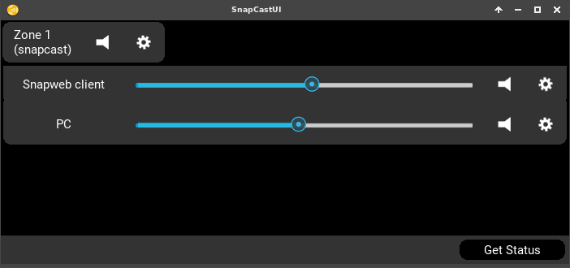

# SnapCastUI

## Overview

This is a **SnapCast server remote (WebSocket API)** written with the Kivy framework and Twisted/Autobahn for **Linux**.

## Download

See in release section, there’s an AppImage

Download it here :
https://github.com/fredele/SnapCastUI/releases/download/0.1/SnapCastUI.AppImage

## Functionnality

From the current API, features include (X) :

### Requests

* Client
  * [Client.GetStatus](https://github.com/badaix/snapcast/blob/master/doc/json_rpc_api/v2_0_0.md#clientgetstatus)
  * [Client.SetVolume ](https://github.com/badaix/snapcast/blob/master/doc/json_rpc_api/v2_0_0.md#clientsetvolume)X
  * [Client.SetLatency](https://github.com/badaix/snapcast/blob/master/doc/json_rpc_api/v2_0_0.md#clientsetlatency) X
  * [Client.SetName ](https://github.com/badaix/snapcast/blob/master/doc/json_rpc_api/v2_0_0.md#clientsetname) X
* Group
  * [Group.GetStatus](https://github.com/badaix/snapcast/blob/master/doc/json_rpc_api/v2_0_0.md#groupgetstatus)
  * [Group.SetMute](https://github.com/badaix/snapcast/blob/master/doc/json_rpc_api/v2_0_0.md#groupsetmute) X
  * [Group.SetStream](https://github.com/badaix/snapcast/blob/master/doc/json_rpc_api/v2_0_0.md#groupsetstream) X
  * [Group.SetClients](https://github.com/badaix/snapcast/blob/master/doc/json_rpc_api/v2_0_0.md#groupsetclients) X
  * [Group.SetName](https://github.com/badaix/snapcast/blob/master/doc/json_rpc_api/v2_0_0.md#groupsetname) X
* Server
  * [Server.GetRPCVersion](https://github.com/badaix/snapcast/blob/master/doc/json_rpc_api/v2_0_0.md#servergetrpcversion) X
  * [Server.GetStatus](https://github.com/badaix/snapcast/blob/master/doc/json_rpc_api/v2_0_0.md#servergetstatus) X
  * [Server.DeleteClient](https://github.com/badaix/snapcast/blob/master/doc/json_rpc_api/v2_0_0.md#serverdeleteclient)
* Stream
  * [Stream.AddStream](https://github.com/badaix/snapcast/blob/master/doc/json_rpc_api/v2_0_0.md#streamaddstream)
  * [Stream.RemoveStream](https://github.com/badaix/snapcast/blob/master/doc/json_rpc_api/v2_0_0.md#streamremovestream)

### Notifications

* Client
  * [Client.OnConnect](https://github.com/badaix/snapcast/blob/master/doc/json_rpc_api/v2_0_0.md#clientonconnect)
  * [Client.OnDisconnect](https://github.com/badaix/snapcast/blob/master/doc/json_rpc_api/v2_0_0.md#clientondisconnect)
  * [Client.OnVolumeChanged](https://github.com/badaix/snapcast/blob/master/doc/json_rpc_api/v2_0_0.md#clientonvolumechanged) X
  * [Client.OnLatencyChanged](https://github.com/badaix/snapcast/blob/master/doc/json_rpc_api/v2_0_0.md#clientonlatencychanged) X
  * [Client.OnNameChanged](https://github.com/badaix/snapcast/blob/master/doc/json_rpc_api/v2_0_0.md#clientonnamechanged) X
* Group
  * [Group.OnMute](https://github.com/badaix/snapcast/blob/master/doc/json_rpc_api/v2_0_0.md#grouponmute) X
  * [Group.OnStreamChanged](https://github.com/badaix/snapcast/blob/master/doc/json_rpc_api/v2_0_0.md#grouponstreamchanged)
  * [Group.OnNameChanged](https://github.com/badaix/snapcast/blob/master/doc/json_rpc_api/v2_0_0.md#grouponnamechanged) X
* Stream
  * [Stream.OnUpdate](https://github.com/badaix/snapcast/blob/master/doc/json_rpc_api/v2_0_0.md#streamonupdate)
* Server
  * [Server.OnUpdate](https://github.com/badaix/snapcast/blob/master/doc/json_rpc_api/v2_0_0.md#serveronupdate)

## Development

Run main.py with Python 2.7 and the additionnal Libraries installed.